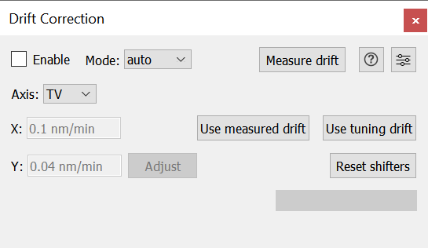

This plug-in implements online drift correction by periodically changing the beam shifters.

It works bei either measuring the current drift rate, using the drift rate measured in tuning or using a drift rate
entered manually by the user. While drift correction is enabled, the drift rate will be decreased exponentially with a
time constant specified in the settings.

Main Window
-----------

The main window lets you control the drift correction. To get started you need to tell the plugin the current drift rate.
This can either be done by measuring it with the integrated "Measure drift" button or by using the drift rate measured
by tuning earlier. Alternatively you can switch "Mode" to "manual" and type a known drift rate into the "X"
and "Y" fields (note that this is only possible when drift correction is disabled). "Auto" mode means the plugin uses
drift rates stored in AS2, whereas "manual" just uses whatever is typed into the plugin UI.

Another way to set the drift rate is to use the "Adjust" button next to the drift rate text fields. Clicking it brings up a
control adjust box known fom adjusting AS2 controls. Note that this can be used while drift correction is active which is
useful to manually fine-tune the drift rate until the live image stops moving.

The "Axis" dropdown menu lets you select which axis is used for manual drift rate adjustment (including the live adjust
functionality). Additionaly the selection of "Axis" affects how "Measure drift" behaves: When "TV" is selected, the drift
rate will be measured using the ronchigram camera. Whereas when "Scan" is selected, the drift rate will be measured in
the first active channel of the scan. In either case, you have to make sure that an image suitable for measuring the
shift between two frames is visible on the respective device.

After measuring the drift rate you need to apply it before it can be used. This may sound complicated, but is needed if
you want to fine tune the measured drift rate by measuring the remaining drift while the correction is running.
In order to use a measured drift rate you simply have to click "Use measured drift". This can be done while drift correction
is enabled or disabled and will update the "X" and "Y" fields in the UI.

In order to use the drift rate measured by tuning simply click "Use tuning drift". This can also be done while drift
correction is enabled or disabled and will update the "X" and "Y" fields in the UI.
Note that using the tuning drift rate does not clear the measured drift rate. So if you "Use tuning drift" and then
"Use measured drift" which has been measured before, you could over correct the actual drift which will look like drift
in the opposite direction.

While drift correction is enabled the plugin will show the used shifter range in the progress bar at the bottom-right corner.
It will also show how much time is left before reaching the maximum shifter range. If no time estimate is shown this means
that you have "infinite" time available because the applied drift will vanish before reaching the maximum shifter range.
If you plan to do a longer experiment it is a good idea to "Reset shifters" before starting the experiment if it would take
longer than the remaining drift correction time. "Reset shifters" will compensate the beam shifter movement with the
sample stage. While the stage is able to move very accurately, you will probably still have to manually move it a bit
to get your area-of-interest back into the spot where you wanted it.

Settings Dialog
---------------

.. image:: resources/drift_correction_settings_window.png
    :align: center
    :width: 25%
    :alt: Drift correction main window

The settings dialog allows you to customize the behavior of the drift correction plugin. The following settings are
available in the UI:

- *Shifter update interval:* Specifies how often the shifters will be updated. A shorter interval will result in a smoother
  movement for high drift rates but there is a limit for how fast this can be done. Defaults to 0.1 s.

- *Measure drift wait time:* Time to wait between the two frames that are used to calculate the current drift rate when
  using the integrated "Measure Drift" tool. A longer time will lead to a more accurate measurement, but you need to make
  sure the same spot on the sample is still visible after the wait time or the measurement will fail. Defaults to 10 s.

- *Drift time constant:* Time constant of the current drift. The applied drift rate will be decreased exponentially with
  this time constant to account for the fact that directional drift usually gets smaller over time. Defaults to 40 min.

- *Maximum shifter range:* Maximum range on the probe shifters. This affects the remaining shifter time displayed in the
  UI and, together with "Auto stop threshold", the point at which drift correction will be disabled automatically for
  safety reasons. Defaults to 100 nm.

- *Auto stop threshold:* Drift correction will be stopped automatically after moving more than "Auto stop threshold" times
  "Maximum shifter range". This is to ensure that the mircoscope will not get misaligned by attempting to do extremely
  large shifts with the beam shifters. A warning will always be displayed after using more than "Maximum shifter range".
  Defaults to 2.

- *Reset Shifters to opposite:* When enabled, clicking on "Reset shifters" in the main window will set the shifters to
  the opposite value of what they were instead of zeroing them. This will double the available range for drift correction
  after the first reset. Defaults to off.

AS2 setup and technical details
-------------------------------

The measured drift rate and the current (i.e. already adjusted by the exponential decrease) drift rate are both stored
in AS2. This has the advantage that one could use other software to measure drift and still use this plugin to apply the
correction. The downside is that AS2 has to be set up correctly in order to have this plugin fully working. See below for
the required AS2 setup:

Required AS2 setup
..................

**The following controls need to exist for the plugin to work correctly!**

- *DriftRate*: This is used to store the measured drift rate when using the integrated "Measure Drift" tool. Also other
  sources may update the drift rate stored here. Must be a 2D control (native axis in "stage" coordinates makes sense).

- *DriftCompensation*: This is the drift compensation rate that will be applied by the plugin. This means that it will
  be the negative "DriftRate". To achieve this, "DriftRate" must drive "DriftCompensation" with a strength of 1! See
  for more details on this. Must be a 2D control (native axis in "stage" coordinates makes sense).

- *CSH:* Beam shifter control. Must be a 2D control that is calibrated in m, otherwise drift correction will not work correctly.

- *SShft:* Stage shifter control. Must be a 2D control that is calibrated in m, otherwise drift correction will not work correctly.

- *Drift:*  Control that tuning uses to store the drift rate measured during tuning. If this doesn't exist, drift correction
  will still work but you cannot use the tuning drift rate for correction.

Technical details
.................

Similarly to other corrections (i.e. in tuning), drift correction also uses a measure-correct scheme enabled via AS2.
This means that measuring drift should *inform* the control "DriftRate" to the measured drift rate. The drift correction
plugin reads the correction it should apply from a second control "DriftCompensation". If "DriftRate" and "DriftCompensation"
are linked properly (i.e. "DriftRate" must drive "DriftCompensation" with strength 1), you can zero "DriftRate" in order
to apply the correct compensation. Zeroing a previously measured "DriftRate" will cause "DriftCompensation" to be set to
the negative "DriftRate" which is exactly what we need for a successful correction.

Clicking the "Use measured drift" button in the plugin will zero "DriftRate" which will have the effect mentioned above.
The button also ensures that the updates in AS2 don't conflict with other updates taking place periodically in the plugin
so it is always preferrable to used the UI buttons over changing things manually when drift correction is enabled.

Clicking "Use tuning drift" will *not* change "DriftRate" but simply copy the drift rate measured in tuning over to
"DriftCompensation" (and takes care of the sign).

The reason for using this (slightly complicated) measure-correct scheme is that it can be used to fine-tune the measured
drift rate. In practice you can measure drift while drift correction is running which will allow for a longer measure
time and therefore a more accurate result. The newly measured drift will simply be written to "DriftRate" (via *inform*)
and can then be added to the applied drift compensation via the "Use measured drift" button in the UI. A few iterations
of this procedure should make the applied drift compensation very accurate. Also measuring drift can be done by other
means than the integrated tool but the drift compensator will still be able to used this drift if put into the right
place.

Optional AS2 controls for persistent settings
.............................................

The settings in the settings dialog will typically be reset to its defaults when you restart Swift. In order to save
the persitently, you have the option to create certain parameters in AS2 which will then be used to store the settings.
There are also a few parameters that cannot be set in the UI but can be changed via AS2 if required.
The table below lists which controls are used to save which setting:

+---------------------------------+--------------------------------+
|             Parameter           |            AS2 Name            |
+=================================+================================+
|      update_interval            | DriftCorrectionUpdateInterval  |
+---------------------------------+--------------------------------+
|      measure_sleep_time         |        DriftMeasureTime        |
+---------------------------------+--------------------------------+
|      ccorr_threshold            |      DriftCcorrThreshold       |
+---------------------------------+--------------------------------+
|      drift_time_constant        |       DriftTimeConstant        |
+---------------------------------+--------------------------------+
|      max_shifter_range          |       MaxShifterRange          |
+---------------------------------+--------------------------------+
|     auto_stop_threshold         |     DiftAutoStopThreshold      |
+---------------------------------+--------------------------------+
|   reset_shifters_to_opposite    |    ResetShiftersToOpposite     |
+---------------------------------+--------------------------------+
